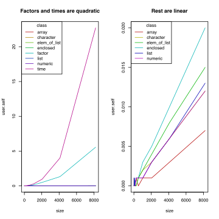

## Performance tuning `rbind.fill`


So it turns out that `rbind.fill` is quadratic in time. Here's a demonstration:


```r
rbind_time <- function(size,
                       classes=c(
                           #"factor", "time",
                           "numeric", "character", "array")) {
  unit <- quickdf(list(numeric = 1:3,
                       character = c("a", "b", "c"),
                       array = array(1:6, c(3,2)),
                       factor = factor(c("a", "b", "c")),
                       time = as.POSIXct(Sys.time()) + 1:3,
                       list = list(1, "two", factor("three"))
                       ))
  args <- rep(list(unit[classes]), size)
  system.time(do.call(rbind.fill, args))
}
get_rbind_times <- function(...) mdply(.fun=rbind_time, ...)

plyr.dir = "~/plyr"
with_dir(plyr.dir, system("git checkout master"))
         library(devtools)
load_all(plyr.dir)
```

```
## Loading plyr
```

```r
rbind.times <- get_rbind_times(expand.grid(size = 2^(1:14)))
```


The above measures rbind.fill binding a large number of data frames
of various column types. Its results:


```r
lines_plot(user.self ~ size, data=rbind.times, group=1,
           main="rbind.fill is quadratic")
```

 


### Factors and `POSIXct` need special handling

I have a suspicion about factor subassignment since
`[<-.factor` is not a primitive function. As part of making `rbind.fill`
faster, first check on which kinds of subassignments happen without a
copy.


```r
subassignment_test <- function(size, class, chunk=10) {
  value <- switch(class,
                  numeric = vector("numeric", size*chunk),
                  character = vector("character", size*chunk),
                  array = array(0, c(size, chunk)),
                  enclosed = (function() {
                    val <- vector("numeric", size*chunk)
                    #tracemem(val)
                    function(where, what) {val[where] <<- what; NULL}
                  })(),
                  factor = f <- rep(factor(letters[1:chunk]), size),
                  time = as.POSIXct(rep(NA, size*chunk)),
                  list = vector("list", size*chunk),
                  elem_of_list = list(vector("numeric", size*chunk)))
  switch(class,
         enclosed=NULL, #it traces its own value
         #tracemem(value)
         )
  inject = switch(class,
                  numeric=1:chunk,
                  character=letters[1:chunk],
                  array = array(1:chunk, c(1, chunk)),
                  enclosed = 1:chunk,
                  factor = factor(letters[1:chunk]),
                  time = as.POSIXct(Sys.time()) + 1:10,
                  list = as.list(letters[1:chunk]),
                  elem_of_list = 1:chunk)
  system.time(for (i in 0:(size-1)) {
    switch(class,
           array = value[i, ] <- inject,
           elem_of_list = value[[1]][(chunk*i+1):(chunk*(i+1))] <- chunk,
           enclosed = value((chunk*i+1):(chunk*(i+1)), chunk),
           value[(chunk*i+1):(chunk*(i+1))] <- inject)
  })
}

subassignment.data <- mdply(
    expand.grid(size = 2^(1:13),
                class = c("numeric", "character", "array",
                          "factor", "time",
                          "enclosed", "list", "elem_of_list"),
                stringsAsFactors = FALSE),
    subassignment_test)
```


The above test checks on the time complexity of doing various forms of
subset assignment, in a situation where it ought to be possible to do it without
making a copy (NAMED of value is always 1, never 2).


```r
with_par(list(mfrow=c(1,2), cex=0.6), {
  lines_plot(user.self ~ size, group=class, data=subassignment.data,
             main="Factors and times are quadratic")
  lines_plot(user.self ~ size, group=class,
             data=subset(subassignment.data, !class %in% c("time", "factor")),
             main="Rest are linear")
})
```

 


This indicates `[<-.factor` has to be forcing a copy. But all the other subset
assignments work well, even the subset-of-element-of-list assignment.
So `rbind.fill` needs to have special handling for factors and times.

### Inspecting an object can set NAMED=2

But note that the original test on rbind.fill did not use factor or POSIXct
columns.  It's quadratic for its own reason, related to how some accessor
functions have a side effect of setting NAMED to 2. Here's what's making
`rbind.fill` slow in the other cases:


```r
accessor_test <- function(size, check_factor, chunk=10) {
  alloc <- vector("numeric", size*chunk)
  inject <- 1:chunk
  system.time(for (i in 0:(size-1)) {
    if (check_factor) checked <- is.factor(alloc)
    alloc[(chunk*i+1):(chunk*(i+1))] <- inject
    NULL
  })
}

accessor.data <- mdply(
    expand.grid(size = 2^(1:12), check_factor = c(FALSE, TRUE)), accessor_test)
```


```r
lines_plot(user.self ~ size, data = accessor.data, group = check_factor,
           main="Calling is.factor() forces a copy")
```

 


Just calling `is.factor()` on a value is enough to bump its NAMED to
2, which forces a copy on the next iteration, turning linear time
complexity into quadratic.

### Performance tracking

While optimizing `rbind.fill`, it's useful to have a record of how
each change affected performance. So I use Git with devtools to
gather performance data across revisions:


```r
revlist <- with_dir(plyr.dir, {
  system("git rev-list master..fastrbind | cut -c 1-6", intern=TRUE)
})
revs <- factor(rev(revlist), levels=rev(revlist)) #plot in order
```


```r
try_rev <- function(rev, tester, ..., dir=plyr.dir) {
  with_dir(dir, {
    system2("git", c("checkout", as.character(rev)))
  })
  load_all(dir)
  cbind(tester(...), rev=rev)
}
```


```r
rev.data <- Map(
    rev=revs, try_rev, 
    MoreArgs=list(tester = get_rbind_times, 
                  expand.grid(size=2^(1:13),
                              classes=c("numeric", "time", "list",
                                        "character", "factor", "array"),
                              stringsAsFactors=FALSE)))
rev.data <- do.call(rbind, rev.data)
```


```r
with_par(list(cex=0.8), { 
  lines_plot(user.self~size, data=subset(rev.data, classes=="numeric"),
             group=rev, main="Time complexity for numeric rbind.fill")
})
```

 


```r
mx <- with(subset(rev.data, size==8192), 5*exp(mean(log(user.self))))
with_par(list(cex=0.8), {
  lines_plot(user.self~as.numeric(rev),
             ylim=c(0, mx),
             xlim=range(as.numeric(rev.data$rev)),
             data=subset(rev.data, size==2^13), group=classes,
             xlab="Revision", frame.plot=FALSE, axes=FALSE,
             bty="n", legend.loc="topright",
             main="Timings for binding 8192 groups")
  with_par(list(las=2), {
    axis(1, at=unique(as.numeric(rev.data$rev)),
         labels=levels(rev.data$rev),
         pos=0)
    axis(2, pos=1)
   })
})
```

 


```r
save(file="output.RData", list=ls())
```


<!---
Local Variables:
eval: (previewing-mode)
eval: (setq previewing-build-command '(
       "\\(.*\\)\\.Rmd$"
       ("Rscript" "-e"
        "library(knitr); knit2html(commandArgs(trailingOnly=TRUE)[[1]])"
        "\\&") "\\1.html"))
End:
-->


